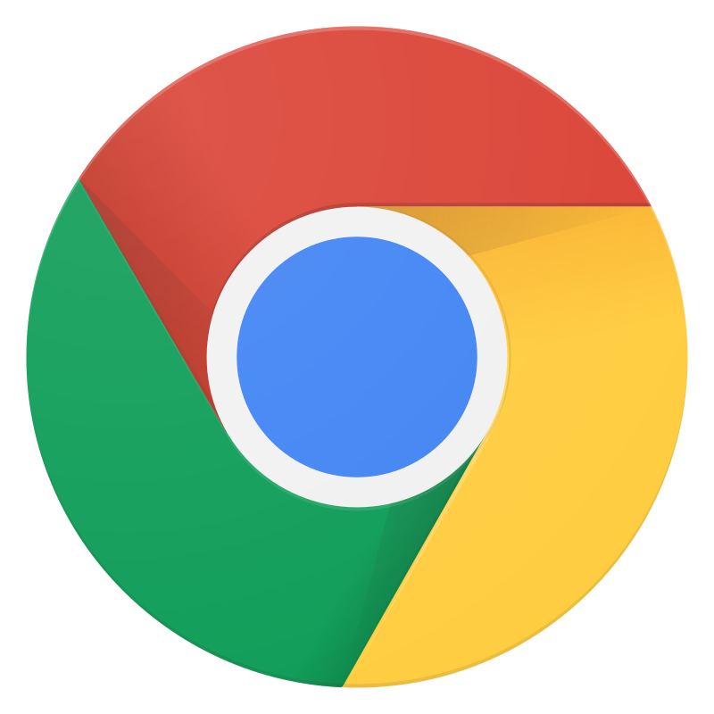
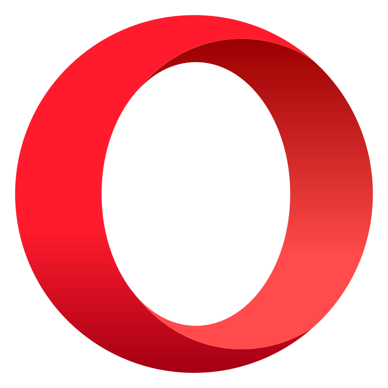
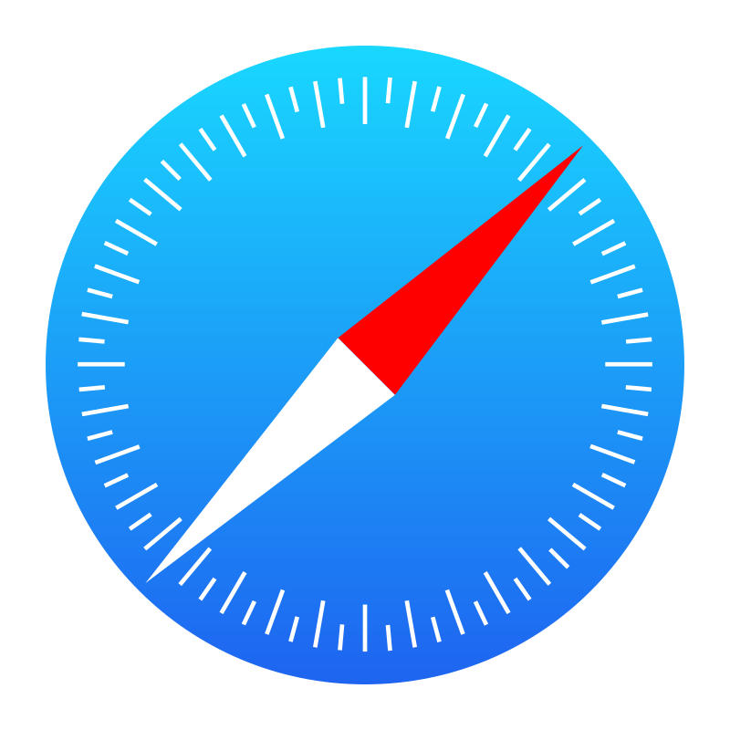
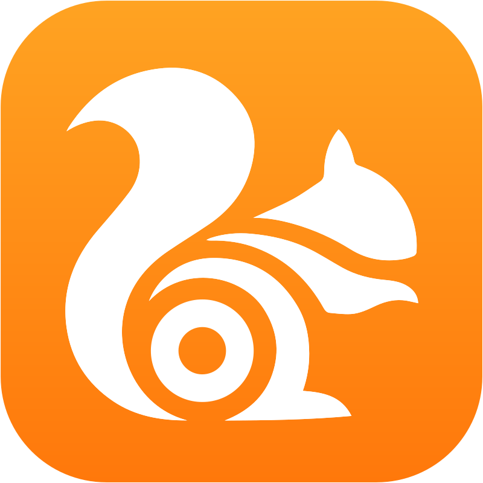
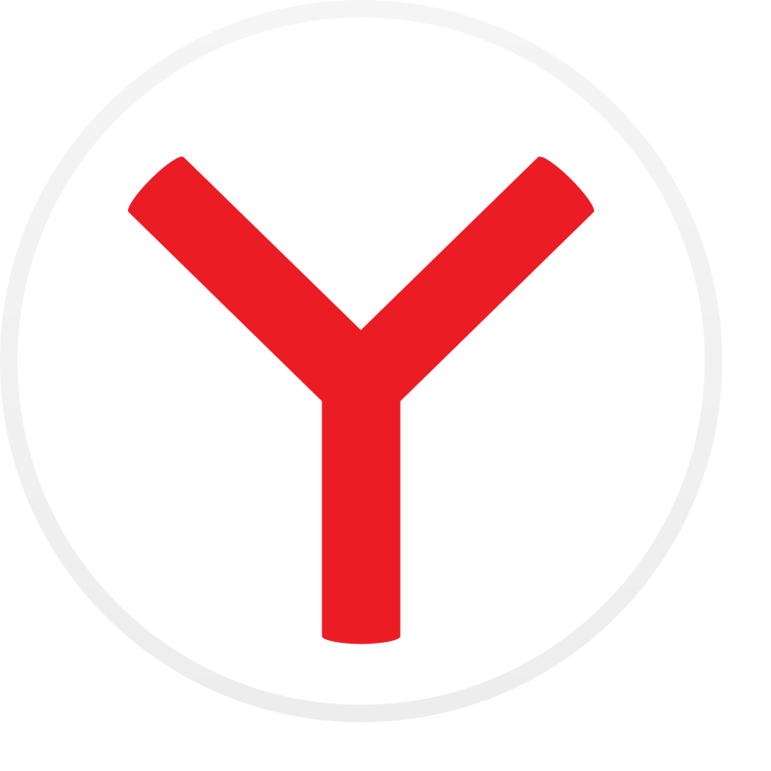
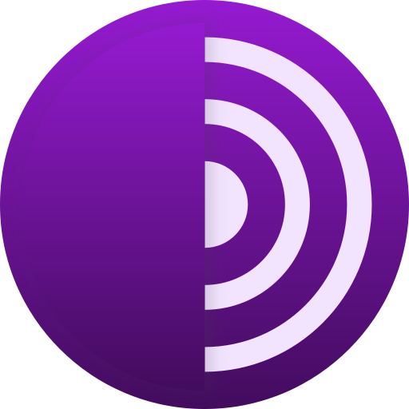

# ✅ Supported Browsers

This project supports the following browsers, each represented with a custom icon and class name for easy styling.

## 🧩 Browsers

| Icon | Name         |
|------|--------------|
|  | Chrome |
|  | Firefox |
|    | Opera |
|   | Safari |
|     | Microsoft Edge |
|  | UC Browser |
|   | Yandex |
|      | Tor Browser |
|  | Maxthon |
| ... | ... |
